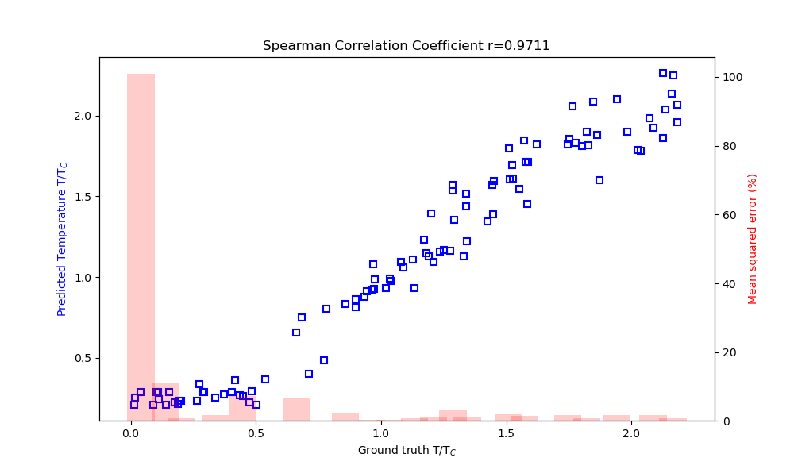
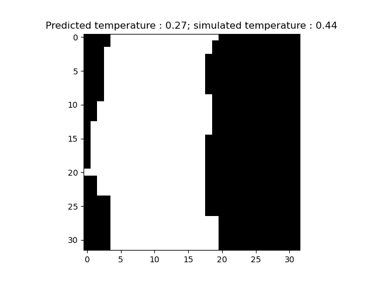
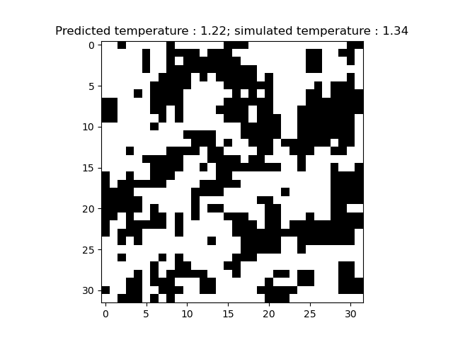
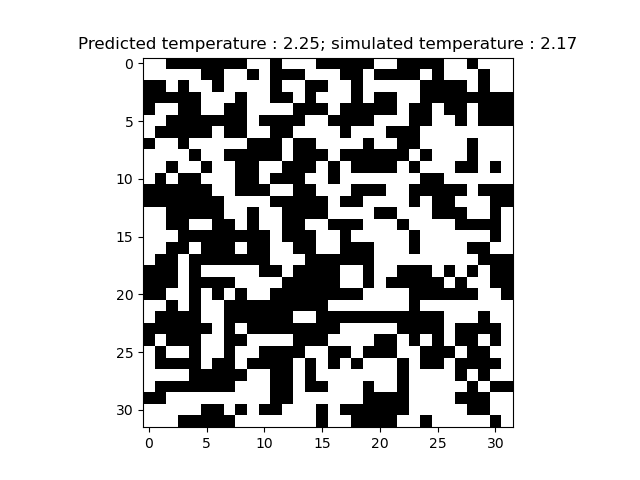

# Neural Ising
## Estimating Critical Temperatures in the Ising Model using Convolutional Neural Networks

A PyTorch implementation of a temperature detector for 2d-Ising spin lattices (32x32).  
The detector consists of a 2 layer CNN with 3 fully connected layers.

## The Ising model
The [Ising model], named after physicist [Ernst Ising],  is a mathematical model used to describe ferrmagnets from a statistical mechanics point of view. is used to simulate a system of spins on a squared lattice (in 2D) with nearest neighbour interaction. Such a model can be used to examine the behaviour of ferromagnets as they transition above the Curie (critical) temperature  into a disordered phase.

The Ising Hamiltonian has the form:

where J is an interspin coupling constant (set to 1 for simplicity)

[Ernst Ising]: https://en.wikipedia.org/wiki/Ernst_Ising
[Ising model]: https://en.wikipedia.org/wiki/Ising_model

## The Data
The dataset is composed by matrices generated using my other repository [gmguarino/Ising], annotated with the corresponding critical temperature, magnetisation and energy. The latter two however, due to the simplicity in calculating them, are omitted from the experiment. 
The training set is composed of 1000 examples, whilst the test set contains 100.

[gmguarino/Ising]: https://github.com/gmguarino/Ising

## Training the Model
The model is composed of 2 convolutional layers and 3 fully connected layers before the output layer. The matrices undergo random flipping both horizontally and vertically during training.  
Training occurs over 30 epochs using a stochastic gradient descent optimizer with [momentum] using mean squared error as a loss function.
* Learning Rate: 0.01
* Momentum: 0.9

[momentum]: https://www.nature.com/articles/323533a0

## Results
Good agreement is found between the temperature predicted by the network and the temperature set during the simulations (both given in terms of , where ).  A spearman correlation coefficient of 0.9711 is found between the two quantities, and from the image below it can be see that there is a higher correlation for high T configurations whilst there is higher error in low end of the spectrum.  

 

At lower temperature there is less information contained in the input matrix (as the system stabilises in an almost complete magnetisation state), so the network can only provide a rough estimate of the temperature (from the above plot it can be seen that the predicted temperature is at an average of 0.2).
 
 

The images below show some of the different configurations of the Ising model at various temperatures:
 

* Low Temperature: 

 

* Close-to-critical Temperature:
 

 

* High Temperature:
 

 